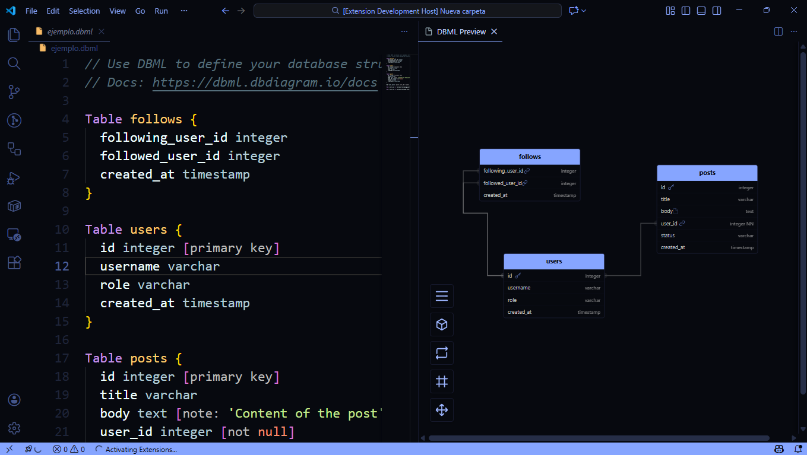
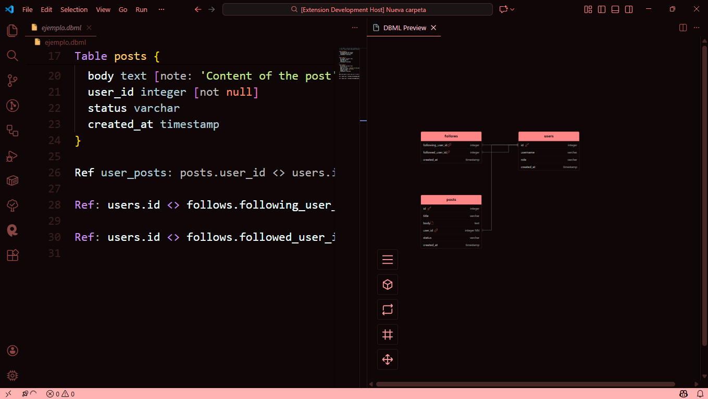

# NOISE DBML

Visual Studio Code extension for previewing DBML (Database Markup Language) relational diagrams.




## Features

- **Interactive Preview**: Pan, zoom, and drag tables.
- **Theme Support**: Automatically adapts to VS Code color themes.
- **Layout Persistence**: Saves your diagram layout and positions.

## Syntax Guide

### Groups

You can group related tables using the `TableGroup` syntax. Groups are visualized with a colored background.

```dbml
TableGroup user_management {
  users
  follows
  // You can add a color or note
  note: "Core user tables"
}
```

### Schemas

You can organize your tables into schemas using the `note` property on a table. Add `schema: your_schema_name` to the table note.

```dbml
Table users {
  id integer
  username varchar
  note: "schema: auth" // This table belongs to the 'auth' schema
}

Table posts {
  id integer
  title varchar
  note: "schema: content" // This table belongs to the 'content' schema
}
```

Tables without a specified schema will be assigned to the `public` schema.

### Documentation Generation

The extension can generate HTML documentation for your database.
1. Open the DBML preview.
2. Click the "Generate Documentation" button in the toolbar.

The documentation will be generated in a `docs` folder next to your DBML file. It includes:
- **Index Page**: A dashboard showing all schemas and project statistics.
- **Schema Pages**: Detailed views for each schema showing tables, columns, and relationships.

### Allowed Syntax

The following syntax is fully supported and recommended for defining tables and relationships:

```dbml
Table follows {
  following_user_id integer
  followed_user_id integer
  created_at timestamp
}

Table users {
  id integer [primary key]
  username varchar
  role varchar
  created_at timestamp
}

Table posts {
  id integer [primary key]
  title varchar
  body text [note: 'Content of the post']
  user_id integer [not null]
  status varchar
  created_at timestamp
}

Ref user_posts: posts.user_id > users.id // many-to-one

Ref: users.id <> follows.following_user_id

Ref: users.id <> follows.followed_user_id
```

### Not Allowed / Unsupported Syntax

The following DBML features are currently **not supported** or will not be rendered in the diagram:

- **Enums**: `Enum` definitions are parsed but not currently visualized.
- **Project Information**: `Project` blocks are ignored.
- **Complex Reference Settings**: While parsed, settings like `[delete: cascade]` or `[update: no action]` are only visible in tooltips and do not change the line style.

## Support

Report issues and request features through the GitHub repository.
